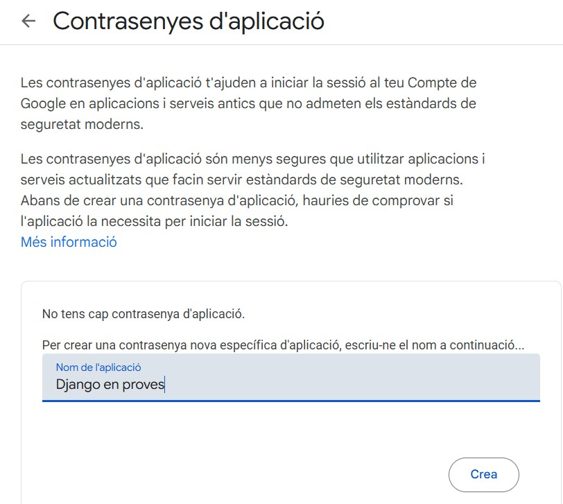

# 📧 Configuració de Compte de Correu i Contrasenya d'Aplicació (Gmail)

L'aplicació Django-Aula utilitza un sistema d'enviament de correus electrònics basat en SMTP per a notificacions (com ara missatges a famílies, recordatoris, etc.). Per utilitzar un compte de Gmail (o Google Workspace) amb seguretat, és necessari crear una **Contrasenya d'Aplicació** (*App Password*), ja que Gmail bloqueja l'accés a aplicacions menys segures mitjançant la contrasenya principal.

### 1. Requisits i Creació del Compte

1.  **Creació del Compte:**
    * **Centres educatius sense Workspace** El compte pot ser quelcom similar a `djau-nomcentreducatiu@gmail.com` i es dedicarà exclusivament a l'aplicació.
    * **Centres Educatius (Workspace):** El compte pot ser quelcom similar a `djau@elteudomini.cat` i s'ha de crear des de la Consola d'Administració en una Unitat Organitzativa (OU) on estigui permès habilitar la verificació en dos passos (2FA).

2.  **Verificació en Dos Passos (2FA):** Aquest pas és obligatori. Per crear una Contrasenya d'Aplicació, primer cal tenir activada la Verificació en Dos Passos al compte.

### 2. Procés per obtenir la Contrasenya d'Aplicació

Un cop el compte estigui creat i tingui la verificació en dos passos activada, seguiu els següents passos des del navegador:

#### Pas A: Accedir a la Configuració de Seguretat

1.  Obriu el navegador i inicieu sessió al compte de correu que fareu servir.
2.  Feu clic a la vostra icona de perfil i accediu a **Gestiona el teu Compte de Google**.
3.  Al menú lateral esquerre, feu clic a **Seguretat**.

#### Pas B: Habilitar i Administrar Contrasenyes d'Aplicació

1.  Dins de la secció de seguretat, cerqueu l'opció **Com es fa per iniciar la sessió a Google**.
2.  Un cop hàgiu activat la Verificació en Dos Passos, hi apareixerà l'opció **Contrasenyes d'aplicació**. Cliqueu-hi.
    * *(Si no veieu aquesta opció, assegureu-vos que heu activat correctament la Verificació en Dos Passos.)*

#### Pas C: Generar la Contrasenya Específica

1.  Se us demanarà que introduïu un **Nom** per identificar l'aplicació que utilitzarà la contrasenya (p. ex., "Django-Aula_VPS"). Això és útil per gestionar-les posteriorment.

2.  Després de donar-li un nom, Google generarà una **Contrasenya d'Aplicació de 16 caràcters**. Aquesta contrasenya només es mostrarà una vegada.

3.  **COPIEU** aquesta contrasenya immediatament.

### 3. Ús durant la Instal·lació

Quan l'script interactiu **`setup_djau.sh`** us sol·liciti les credencials del sistema de correu SMTP, haureu d'introduir:

* **Adreça de Correu SMTP:** L'adreça principal del compte que heu creat.
* **Contrasenya d'Aplicació (App Password):** La contrasenya de 16 caràcters que acabeu de generar (sense espais).

---