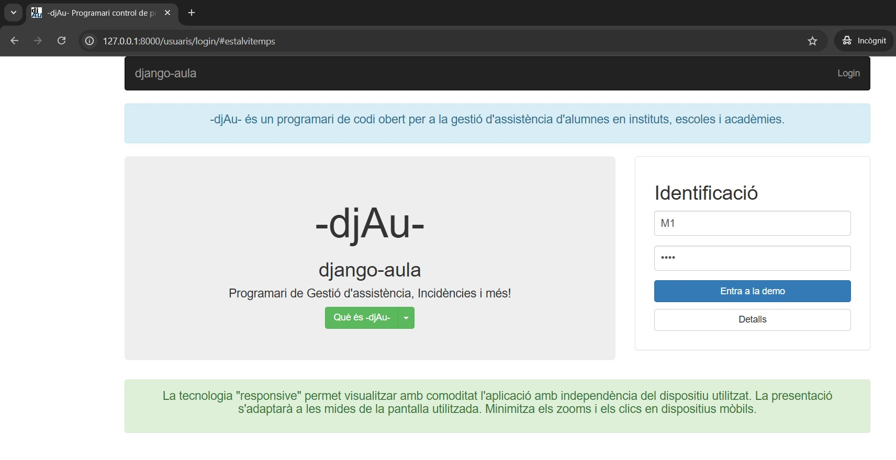
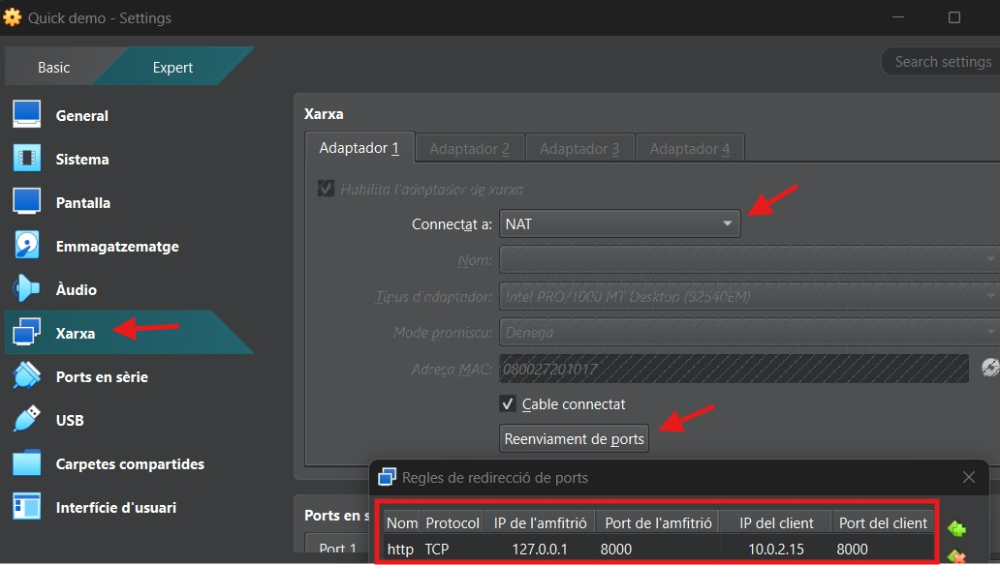
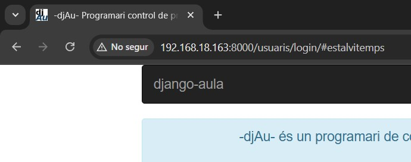
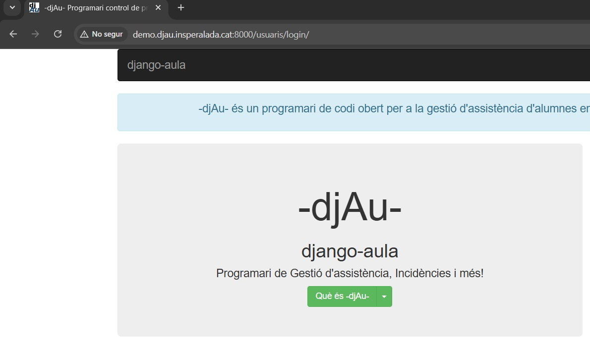

# Instal·ació manual de la Demo de Django-Aula

Aquesta guia ofereix les **instruccions per instal·lar manualment una instància d'un entornt de prova (Demo) de Django-Aula** amb un conjunt de dades fictícies (usuaris, professors i horaris) per tal de provar-ne les funcionalitats.  
Aquest mètode està dissenyat per a entorns de prova, no de producció.

---

# índex
  - [1. Requisits de Servidor](#1-Requisits-de-Servidor)
  - [2. Usuaris que es crean en la Demo i les seves credencials](#2-Usuaris-que-es-crean-en-la-Demo-i-les-seves-credencials)
  - [3. Instruccions d'Instal·lació](#3-Instruccions-dInstal·lació)
    - [3.1 Preparació de l'Entorn](#31-Preparació-de-lEntorn)
    - [3.2 Clonació del repositorio i Instal·lació de l'Aplicació](#32-Clonació-del-repositorio-i-Instal·lació-de-lAplicació)
    - [3.3 Creació de Dades i Execució](#33-Creació-de-Dades-i-Execució)
    - [3.4. Accés a la Demo amb Entorn Gràfic (Màquina Local)](#34-Accés-a-la-Demo-amb-Entorn-Gràfic-Màquina-Local)
  - [4. Accedir des d'un altre ordinador a la màquina on s'ha instal·lat la Demo](#4-Accedir-des-dun-altre-ordinador-a-la-màquina-on-sha-instal·lat-la-Demo)
    - [4.1 Màquina virtual creada amb VirtualBox i configurada amb xarxa NAT](#41-Màquina-virtual-creada-amb-VirtualBox-i-configurada-amb-xarxa-NAT)
    - [4.2 Màquina virtual creada amb VirtualBox i configurada amb xarxa BRIDGE (pont)](#42-Màquina-virtual-creada-amb-VirtualBox-i-configurada-amb-xarxa-BRIDGE-pont)
    - [4.3 Instal·lació de la Demo en un servidor públic amb accés extern (VPS)](#43-Instal·lació-de-la-Demo-en-un-servidor-públic-amb-accés-extern-VPS)
    - [4.4 Resum de les modificacions de la llista *ALLOWED_HOSTS* de l'arxiu *common.py*](#44-Resum-de-les-modificacions-de-la-llista-ALLOWED_HOSTS-de-larxiu-commonpy)
  - [5 Mantenir l'execucíó indefinida en el temps del servidor de Demostració](#5-Mantenir-lexecucíó-indefinida-en-el-temps-del-servidor-de-Demostració)

---

## 1. Requisits de Servidor

* **Sistema Operatiu:** Ubuntu Server 22.04 LTS o Debian 13.
* **Accés:** Es requereix un usuari amb accés a `sudo`.  
    **[Documentació per crear un nou usuari amb permisos de `sudo`](USUARI_SUDO.md)** 


## 2. Usuaris que es crean en la Demo i les seves credencials

Els usuaris de prova creats en el procés d'instal﹞lació tenen les següents credencials:

| Rol | Usuaris |
| :--- | :--- |
| **Professors** | `M0 ,M5 ,T0 ,T1 ,T3` |
| **Tutors** | `M2 ,M3 ,M4 ,M7 ,T2 ,T4 ,T5` |
| **Direcció** | `M1 ,M6, T1` |
| **Alumnat rang** | `almn1 - almn229` |

**Notes Importants sobre la Demo**

- **Contrasenya única**: Tots els usuaris de prova (Professors, Tutors, Direcció) utilitzen la contrasenya: **djAu**.
- Actualització de Dades: La base de dades de la Demo es refà automàticament a cada hora amb dades generades de manera aleatòria.
- Cookies: Aquest programari utilitza cookies estrictament per al manteniment de la sessió.


---

## 3. Instruccions d'Instal·lació

Aquestes comandes es poden executar en un entorn Linux, preferiblement Debian 13 o Ubuntu Server 24.04 LTS o superior.

### 3.1 Preparació de l'Entorn

Cal instal·lar les dependències bàsiques necessàries del sistema:

```bash
sudo apt-get update
sudo apt-get install python3 python3-venv python3-dev git

# Dependències per a lxml (necessari per a l'anàlisi d'XML i HTML)
sudo apt-get install python3-lxml python3-libxml2 libxml2-dev libxslt-dev lib32z1-dev

# Llibreries gràfiques (necessàries en alguns entorns de desenvolupament)
sudo apt-get install libgl1 libglib2.0-0t64
```

### 3.2 Clonació del repositorio i Instal·lació de l'Aplicació

```bash
# Crear un directori de treball i clonar el projecte
mkdir djau
cd djau
git clone --single-branch --branch master [https://github.com/ctrl-alt-d/django-aula.git](https://github.com/ctrl-alt-d/django-aula.git) django-aula
cd django-aula

# Crear i activar l'entorn virtual
python3 -m venv venv
source venv/bin/activate

# Instal﹞lar les dependències de Python
pip3 install -r requirements.txt
```

### 3.3 Creació de Dades i Execució

Un cop instal·lat, executeu l'script que crea les dades de demostració (professors, alumnes, horaris) i inicia el servidor de desenvolupament incorporat:

```bash
# Crea un conjunt de dades fictícies per a la Demo
./scripts/create_demo_data.sh

# Inicia el servidor local de Django (mode desenvolupament)
python manage.py runserver
```
Un cop executat `python manage.py runserver` dins l'entorn virtual (venv) veuríem quelcom similar a:

```text
(venv) djau@djau:~/djau/django-aula$ python manage.py runserver
Watching for file changes with StatReloader
Performing system checks...

System check identified no issues (0 silenced).
octubre 30, 2025 - 02:27:21
Django version 5.1.13, using settings 'aula.settings'
Starting development server at http://127.0.0.1:8000/
Quit the server with CONTROL-C.
```

### 3.4. Accés a la Demo amb Entorn Gràfic (Màquina Local)

COm hem vist amb la secció anterior, quan s'executa la comanda `python manage.py runserver` l'aplicació es posa en marxa a l'adreça local del servidor: `http://127.0.0.1:8000`.

Si la Demo s'ha instal·lat en un ordinador, o a una màquina virtua, que disposa d'un **escriptori gràfic i un navegador web** podreu accedir-hi directament obrint el navegador i anant a:

**http://127.0.0.1:8000**




## 4. Accedir des d'un altre ordinador a la màquina on s'ha instal·lat la Demo

Si intenteu accedir a la Demo des d'una màquina on no s'hagi instal·lat la Demo no podreu accedir amb la IP `127.0.0.1` 

La primera acció és **canviar la forma d'executar el servior local** de desenvolupament

```bash
# Execució del servidor amb accés extern
python manage.py runserver 0.0.0.0:8000
```
La sortida que veurem serà similar a la vista anteriorment:

```text
(venv) djau@djau:~/djau/django-aula$ python manage.py runserver 0.0.0.0:8000
Watching for file changes with StatReloader
Performing system checks...

System check identified no issues (0 silenced).
octubre 30, 2025 - 02:27:21
Django version 5.1.13, using settings 'aula.settings'
Starting development server at http://0.0.0.0:8000/
Quit the server with CONTROL-C.
```

Engegant el servidor local d'aquesta manera posibilita servir la Demo en qualsevol Ip que estigui configurada en la llista `ALLOWED_HOSTS`.

Per modificar aquesta llista **caldrà accedir i editar l'arxiu `common.py`**, que es troba al directori `django-aula/aula/settings_dir`.

```bash
nano django-aula/aula/settings_dir/common.py
```

### 4.1 Màquina virtual creada amb VirtualBox i configurada amb xarxa NAT

Si utilitzeu una màquina virtual amb configuració de xarxa **NAT**, heu de configurar una redirecció de ports als paràmetres de xarxa per tal que redirigeixi el trànsit del *host* al *guest* (màquina virtual):

#### 4.1.1 Configuració de Redirecció de Ports de la màquina virtual (Host)

| Camp | Valor |
| :--- | :--- |
| **Nom** | `http` |
| **IP Host** | `127.0.0.1` |
| **Port Host** | `8000` |
| **IP Guest** | `10.0.2.15` (Típicament però cal comprobar-ho amb `ip a`) |
| **Port Guest** | `8000` |



#### 4.1.2 Modificació de la llista ALLOWED_HOSTS de la Demo

Per que la Demo respongui després de fer la redirecció de ports als paràmetres de la xarxa NAT de virtualBox, cal editar el fitxer de configuració de Django i afegir l'adreça IP des de la qual accedireu i que s'h definit en la redirecció de ports:

**Modifiqueu la variable `ALLOWED_HOSTS`** dins l'arxiu `common.py`. 

Busqueu la línia `ALLOWED_HOSTS = []` i afegiu l'adreça del host `ALLOWED_HOSTS = ['127.0.0.1']`

Obriu un navegador en la màquina on s'ha instal·lat VirtualBox i podreu escriure:  
**http://127.0.0.1:8000**


### 4.2 Màquina virtual creada amb VirtualBox i configurada amb xarxa BRIDGE (pont)

Si volem que la màquina virtual tingui la seva pròpia adreça IP, gestionada pel gestor DHCP de la xarxa interna local, podem seleccionar el paràmetre `bridge` en comptes de `NAT`.

Si fem la comanda `IP a` obtindrem l'adreça IP de la màquina virtual creada (guest).

```bash
djau@djau:~$ ip a
1: lo: <LOOPBACK,UP,LOWER_UP> mtu 65536 qdisc noqueue state UNKNOWN group default qlen 1000
    link/loopback 00:00:00:00:00:00 brd 00:00:00:00:00:00
    inet 127.0.0.1/8 scope host lo
       valid_lft forever preferred_lft forever
    inet6 ::1/128 scope host noprefixroute
       valid_lft forever preferred_lft forever
2: enp0s3: <BROADCAST,MULTICAST,UP,LOWER_UP> mtu 1500 qdisc fq_codel state UP group default qlen 1000
    link/ether 08:00:27:20:10:17 brd ff:ff:ff:ff:ff:ff
    altname enx080027201017
    inet 192.168.18.163/24 brd 192.168.18.255 scope global dynamic noprefixroute enp0s3
       valid_lft 3371sec preferred_lft 2921sec
    inet6 fe80::350b:3ecd:ef4:a9b5/64 scope link dadfailed tentative
       valid_lft forever preferred_lft forever
``` 

**Modifiqueu la variable `ALLOWED_HOSTS`** dins l'arxiu `common.py`. 

Busqueu la línia `ALLOWED_HOSTS = []` i afegiu l'adreça del host `ALLOWED_HOSTS = ['127.0.0.1', 'IP_DEL_GUEST']`  
En aquest cas d'exemple `ALLOWED_HOSTS = ['127.0.0.1', '192.168.18.163']`

Obriu un navegador en la màquina (host) on s'ha instal·lat VirtualBox i podreu escriure:  
**http://192.168.18.163:8000**



#### Opcional - Aconseguir una IP Estàtica

**Atenció: La IP de la màquina virtual pot canviar quan s'apaga** i es torna a engegar perquè l'IP de la maquina Demo l'otorga el sistema DHCP de la xarxa interna, que entrega adre?eces IP a les màquines de forma variable, és a dir, no sempre pot tenir la mateixa IP.

**Per mantenir la IP de forma estàtica** les úniques instruccions amb les que he tingut èxit són les que trobareu al blog de [voidnull.es](https://voidnull.es/netplan-configura-tu-red-de-forma-sencilla-con-yaml/)  

Les passes a seguir són les següents:

1 - Instal·lar netplan
```bash
sudo apt install netplan.io
```
2 - Editar el arxiu de configuració en format yaml
```bash
sudo nano /etc/netplan/01-netcfg.yaml
```
3 - Crear l'arxiu en format `yaml` amb la configuració per a la IP estàtica que es vol.  

A l'exemple següent es mostra l'adreça IP del meu Gateway (Router) i estic definint com IP estàtica aquella que en un principi el servidor DNS de la meva xarxa local ja havia assignat a la màquina Demo.

```yaml
network:
  version: 2
  renderer: networkd
  ethernets:
    enp0s3:
      dhcp4: no
      addresses: [192.168.18.163/24] # IP estàtica que es vol configurar i màscara
      routes:
        - to: default
          via: 192.168.18.1        # Gateway (IP del router)
      nameservers:
        addresses: [192.168.18.1, 8.8.8.8]  # IPs de DNS
```

4 - Aplicar els permisos corresponents a l'arxiu yaml

```bash
sudo chmod 600 /etc/netplan/01-netcfg.yaml
```

5 - Habilita i Inicia el gestor de xarxes de Netplan, el servei `systemd-networkd`, i aplica canvis. Es pot reiniciar també el sistema i comprobar, amb `IP a`, que tenim l'adreça configurada o que en tenim una de nova si hem decidit canviar-la

```bash
sudo systemctl enable systemd-networkd
sudo systemctl start systemd-networkd
```
En aquest moment, si tenies una connexió SSH oberta s'haurà perdut sempre i quan s'hagi canviat l'IP que tenies, de forma automàtica, per una altra estàtica nova difererent de l'anterior.

Aplica la configuració de Netplan

```bash
sudo netplan apply
```

Ara ja tens l'IP estàtica. Pots comprovar-ho amb `ip a` i reiniciant la màquina virtual Demo.


### 4.3 Instal·lació de la Demo en un servidor públic amb accés extern (VPS)

Tot servidor a internet té una IP pública i és convenient definir un domini o subdomini per accedir-hi. Consulteu el document [Registres DNS](REGISTRES_DNS.md) si no recordeu com fer-ho. En aquest cas, s'han creat dos subdominis que apunten a l'IP pública del servidor VPS:  
> demo.djau.domini.cat  
> www.demo.djau.domini.cat

A més a més ha calgut buscar entre les opcions del panel de control del proveïdor del VPS allò que en diuen *Polítiques de Firewall* per tal d'obrir el port 8000, que és el port que obrirem amb el servidor web per a proves de Django.

El procés per instal·lar la Demo és el definit a l'apartat 1.1 i 1.2 i a l'hora d'aixecar el servidor de proves, si volem anar sobre segur, hem fet servir  :
```bash
python manage.py runserver 0.0.0.0:8000
```

Ara bé, hem hagut d'editar l'arxiu common.py: 
```bash
nano django-aula/aula/settings_dir/common.py
```
I modificar la llista ALLOWED_HOSTS, de tal manera que hem afegit els dos subdominis creats i, a més a més, l'IP pública del servidor VPS.

`ALLOWED_HOSTS = ['demo.djau.domini.cat', 'www.demo.djau.domini.cat', '127.0.0.1', 'IP_PúBLICA_VPS',]`

De fet, el servidor de proves de Django el podriem aixecar perfectament posant l'IP pública del VPS, en comptes de 0.0.0.0
```bash
python manage.py runserver IP_PúBLICA_VPS:8000
```

D'aquesta senzilla manera, sense haver d'instal·lar un servidor web Apache com per la versió de l'aplicatiu per producció, podem servir la versió Demo de l'aplicatiu a tot aquell, des de qualsevol ordinador a internet, com funciona Django-Aula, simplement:

http://[IP_DEL_TEU_SERVIDOR]:8000  
http://[subdomini]:8000




### 4.4 Resum de les modificacions de la llista *ALLOWED_HOSTS* de l'arxiu *common.py*

| Entorn | Configuració de `ALLOWED_HOSTS` |
| :--- | :--- |
| **Màquina Virtual (VirtualBox NAT)** | `ALLOWED_HOSTS = ['127.0.0.1']` |
| **Xarxa Interna Local** | `ALLOWED_HOSTS = ['127.0.0.1', 'IP_DEL_GUEST']` |
| **VPS (Accés per Domini)** | `ALLOWED_HOSTS = ['127.0.0.1', 'IP_PúBLICA_VPS', 'demo.djau.domini.cat', 'www.demo.djau.domini.cat',]` |


## 5 Mantenir l'execucíó indefinida en el temps del servidor de Demostració

Normalmente accedim a la màquina on hem instal·lat la Demo des d'un terminal de la nostra màquina personal, amb Linux o Windows, mitjan?ant el protocol SSH.

Ara bé, **quan tanquem la connexió SSH el procés** que genera el servidor (*python manage.py runserver*) **també es tanca**, deixant de funcionar, i **la Demo de Django-Aula ja no és accessible**.

---

**Instruccions per l'execucíó indefinida en el temps del servidor de Demostració**

Si es vol que la Demo estigui disponible el temps que necessitem, mentre no s'apagui físicament el servidor que l'està executant, la manera d'executar *python manage.py runserver* canvia. Ara haurem d'engegar el servidor *runserver* de la següent manera:

```bash
nohup python -u manage.py runserver IP_PúBLICA_VPS:8000 &
```

* **nohup** desconnecta el procés de la sessió ssh (encara que si fem *ctrl-c* el procés s'aturarà igualment).
* **-u** indica a python que s'executi en mode sense memòria intermèdia per no perdre cap sortida del procés.
* odeu afegir **&** després de l'ordre per empènyer el procés immediatament a segon pla i recuperar el shell, mantenint l'ús de *ctrl-c*.

Per tancar el servidor *runserver* de python tenim dues opcions:
1. Es pot reiniciar el servidor
2. Es pot buscar l'ID del procés i detenir-lo.

Per explorar la segona opció cal buscar l'identificador del procés i *matar-lo*. El procés seria el següent:

1 - Mostrar totes les ordres python en execució:
```bash
ps aux | grep python
```
2 - Trobar l'ID del procés de l'ordre que es vol aturar i després aturar-lo:
```bash
kill <id>
```
on cal substituir <id> amb l'ID del procés obtinguda mitjançant `ps aux`.