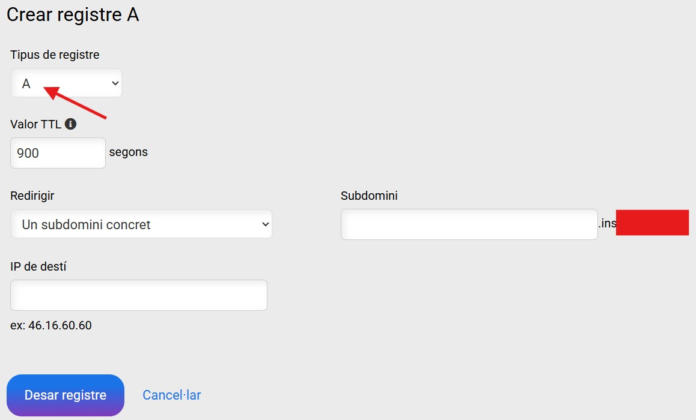
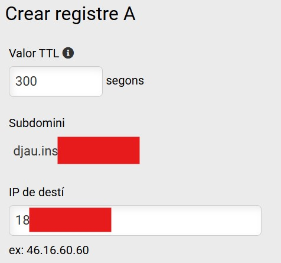
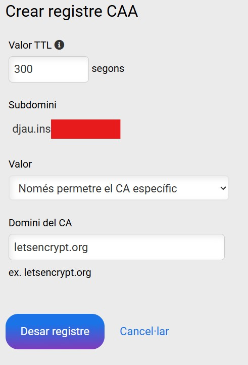
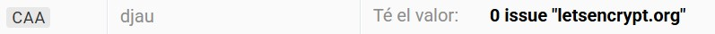
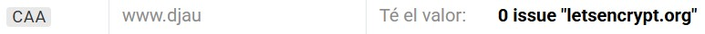

# ?? Configuraci車 de Registres DNS per a Acc谷s P迆blic (VPS)

Per poder accedir a l'aplicaci車 des d'Internet mitjan?ant un domini (i no nom谷s per la IP), cal tenir un domini contractat i configurar els registres DNS que apunten a l'adre?a IP del servidor VPS.

A m谷s, per tal que el proc谷s d'instal﹞laci車 automatitzada pugui generar els certificats de seguretat **Let's Encrypt** (HTTPS), calen uns registres addicionals (tipus CAA).

### 1. Requisits

* **Domini Contractat:** Cal tenir un domini propi (p. ex., `elteudomini.cat`).
* **Gestor DNS:** Acc谷s al panell de control de DNS que proporciona l'empresa contractada.
* **Adre?a IP P迆blica:** Con豕ixer l'adre?a IP p迆blica del vostre servidor VPS.

---

## 2. Creaci車 dels Registres de Tipus A (Acc谷s)

Els registres de tipus **A** s車n els encarregats de traduir el nom de domini (URL) a l'adre?a IP num豕rica del vostre servidor.

### 2.1 Registre del Subdomini Principal (`djau`)

Cal crear un registre **A** que defineixi el subdomini de l'aplicaci車 i l'apunti a la IP del VPS.

| Camp | Valor |
| :--- | :--- |
| **Tipus de Registre** | **A** (Address Record) |
| **Nom/Subdomini** | `djau` |
| **Destinaci車/IP** | L'adre?a IP del vostre VPS |

Un cop creat, el registre apareixer角 al llistat del panell de control de DNS:

En visualitzar els detalls del registre creat, es veur角 la correspond豕ncia entre el subdomini complet i la IP:

### 2.2 Registre del Subdomini `www.` (Opcional)

Per assegurar que els usuaris que afegeixen el prefix `www.` al domini puguin accedir sense problemes (i perqu豕 el proc谷s de certificaci車 de Let's Encrypt ho cobreixi), 谷s recomanable crear un segon registre **A**:

| Camp | Valor |
| :--- | :--- |
| **Tipus de Registre** | **A** (Address Record) |
| **Nom/Subdomini** | `www.djau` |
| **Destinaci車/IP** | L'adre?a IP del vostre VPS |

---

## 3. Creaci車 dels Registres de Tipus CAA (Let's Encrypt)

Els registres de tipus **CAA** (Certification Authority Authorization) especifiquen quines entitats (CAs) estan autoritzades a emetre certificats per al vostre domini. Aquest registre 谷s **imprescindible** per permetre que **Certbot/Let's Encrypt** pugui generar autom角ticament els certificats.

Cal crear un registre CAA pel subdomini principal i un altre per si s'ha optat per crear-ne un altre pel subdomini que comen?a per www, del tal manera que permeti expressament que la CA Let's Encrypt (identificada com `letsencrypt.org`) emeti certificats per als vostres subdominis .

### 3.1 Registres CAA

| Camp | Valor |
| :--- | :--- |
| **Tipus de Registre** | **CAA** (Certification Authority Authorization) |
| **Nom/Subdomini** | `djau` i `www.djau`|
| **Valor/Target** | `0 issue "letsencrypt.org"` |

En visualitzar els detalls d'un dels registres creats, es veur角 la correspond豕ncia entre el subdomini complet i l'entitat certificadora CA Let's Encrypt:

Un cop creat, els registres haurien d'apar豕ixer al panell de control de DNS:

**Nota:** Despr谷s de crear o modificar qualsevol registre DNS, pot trigar unes hores (temps de propagaci車) fins que els canvis siguin efectius arreu del m車n.