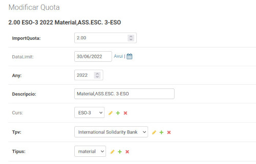

# Quotes

Des de Gestió / Quotes / Assigna-Modifica Quotes es poden assignar, fraccionar i esborrar.

Les quotes permeten fer pagaments anuals per diferents conceptes no associats a cap sortida i generals per cursos complets.

Permet definir quotes anuals que hauria de pagar cada alumne com: material, llibres, ampa, extraescolars ...

Les quotes corresponen a un curs, un tipus i un any.
Per exemple: Material 2n ESO 2020 o Llibres 4t ESO 2020

Cada alumne pot tenir una quota de cada tipus cada any.
Es poden fraccionar en 2 pagaments.

Aquesta gestió la poden fer els usuaris de direcció, administradors i un nou grup 'tpvs'.

## Funcionament

Es selecciona el curs, tipus de quota i any i es mostrarà la llista d'alumnes.

S’ha d’escollir una quota per a cada alumne. L'opció automàtica assigna la quota més adient. En automàtic intenta trobar una quota adequada segons l'any, curs i tipus. Habitualment s'assignarà la quota al final del curs escolar (maig o juny) per al curs següent, als alumnes del curs X els assigna la quota per al curs següent X+1.

Per exemple: Si assignem la quota de material per als alumnes que finalitzen 2n ESO, el que es fa és assignar la quota de 3r ESO que correspon al curs següent.

Els canvis són efectius una vegada s'ha fet clic al botó "Enviar dades", aleshores s'actualitzen els pagaments.

Opció fracciona: Crea dos pagaments, un amb data límit segons la quota i el següent 3 mesos després.

Es poden esborrar si encara no s'han pagat, deixant en blanc la quota. Si s'esborra un fraccionament, aleshores s'esborra la parella.

## Informes

Des de Gestió / Quotes / Descàrrega acumulats

Permet descàrrega d'un full excel amb el resum de pagaments, per mesos, segons tpv i any.

## Definició com a administrador

Des d'admin es poden gestionar els TPVs, tipus de quota i quotes.

### TPV

TPVs: Es poden definir varis. D'aquesta manera es poden diferenciar els pagaments segons centre, ampa ...


Es poden definir diversos TPV.
El tpv per defecte és el que fa servir el nom "centre".

### Tipus de quota

Permet diferenciar les quotes, cada alumne pagarà com a màxim una quota a l'any de cada tipus.
Per exemple: material, llibres, ampa ...

### Quotes

Tenen el seu import, any, descripció, tipus, curs, data límit i el tpv a on es paga.

Exemple:

```text
import any  descripció      tipus    curs  data_límit
  40  2021  Material 1r ESO material ESO-1 15/7/2021
  50  2021  Material 1r BAT material BAT-1 15/7/2021
```

Si no s'indica el curs, aleshores serveix per a tots els alumnes.
Si no s'indica el tpv, farà servir el tpv 'centre'. Si no existeix 'centre', farà servir les dades indicades al settings.
La data límit és informativa, es poden fer pagaments passada la data.



### Settings

CUSTOM_QUOTES_ACTIVES = True

Dades del TPV per al pagament (si no s'ha definit a la base de dades):

CUSTOM_CODI_COMERÇ='XXXXXXXX’'

CUSTOM_KEY_COMERÇ='xnxnxnxnxnxnxnxnxnxnxnxnxnxnxnxnxnxnx’'

CUSTOM_REDSYS_ENTORN_REAL = True

També es pot fer la configuració del TPV a la base de dades.
Des de les opcions d’administració de django, URL_DJANGO_AULA/admin

Documents necessaris per al pagament online i la protecció de dades

DADES_FISCALS_FILE = location( r'../customising/docs/DADESFISCALS' )

POLITICA_VENDA_FILE = location( r'../customising/docs/POLITICAVENDA' )

POLITICA_COOKIES = location( r'../customising/docs/POLITICACOOKIES' )

POLITICA_RGPD = location( r'../customising/docs/POLITICARGPD' )
